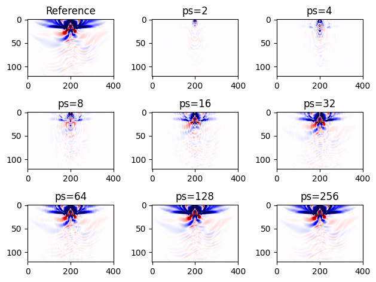
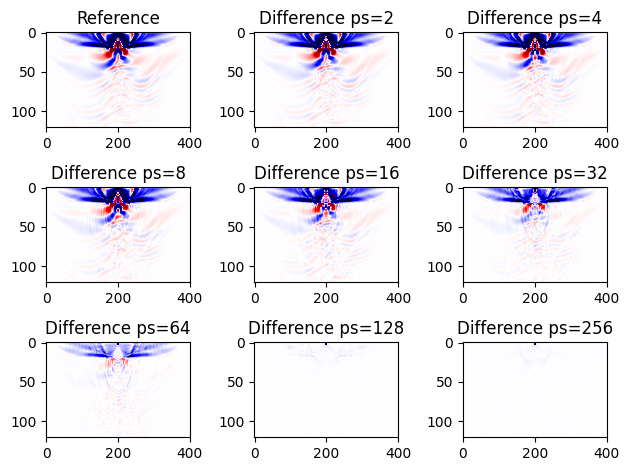
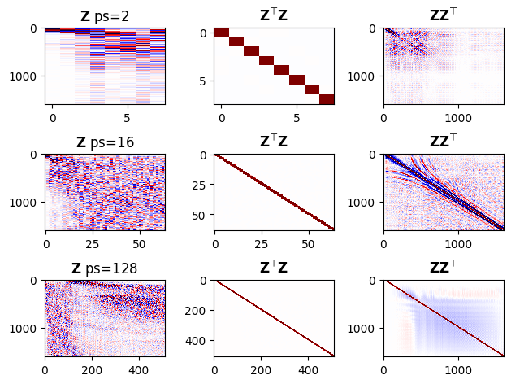
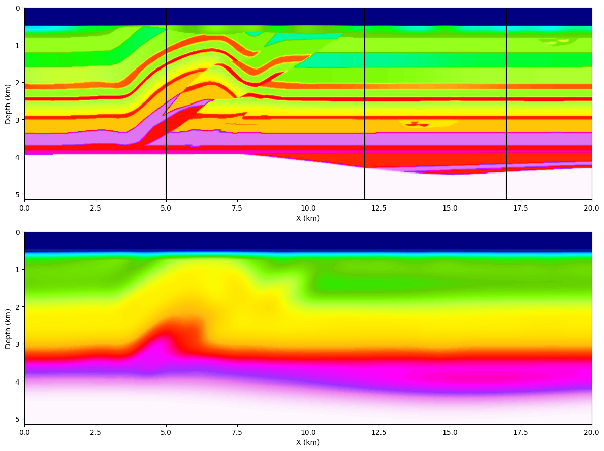
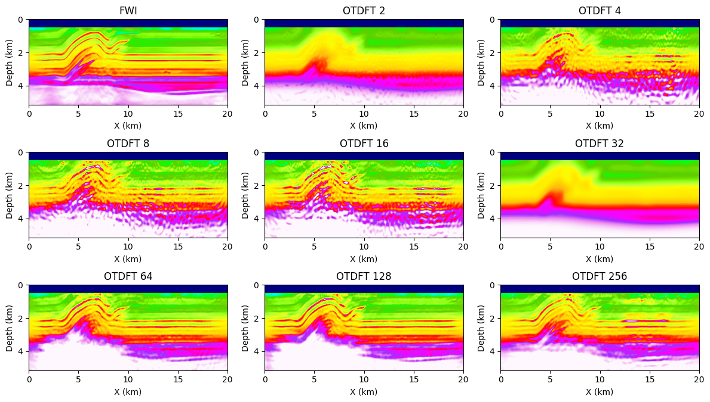
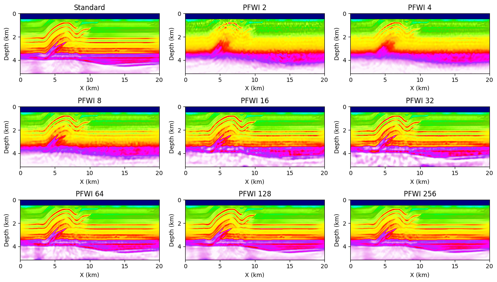
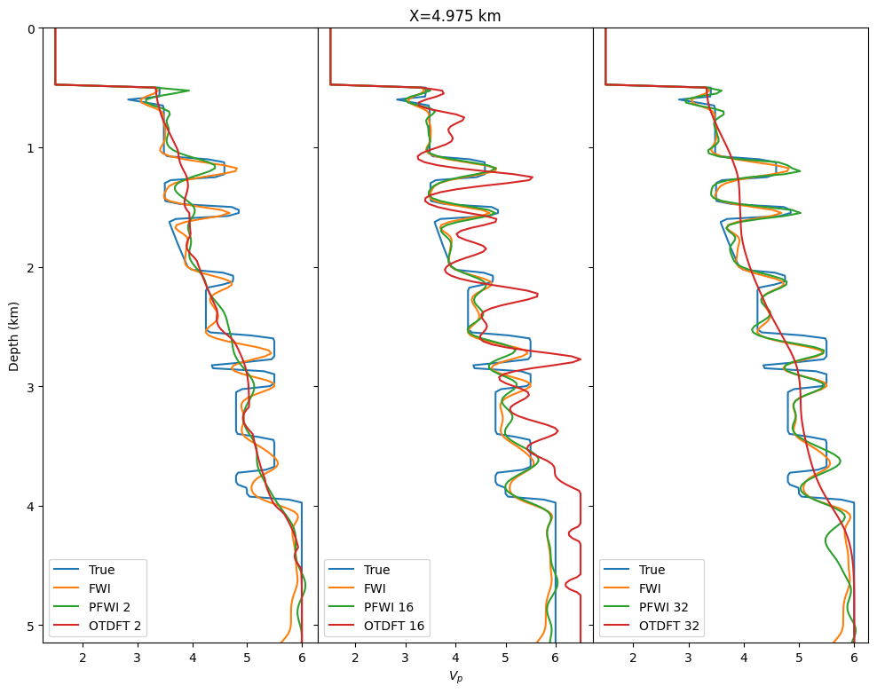
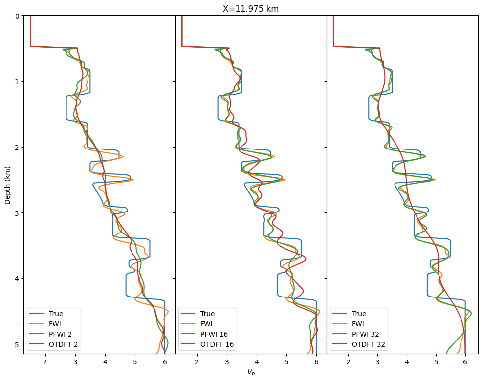
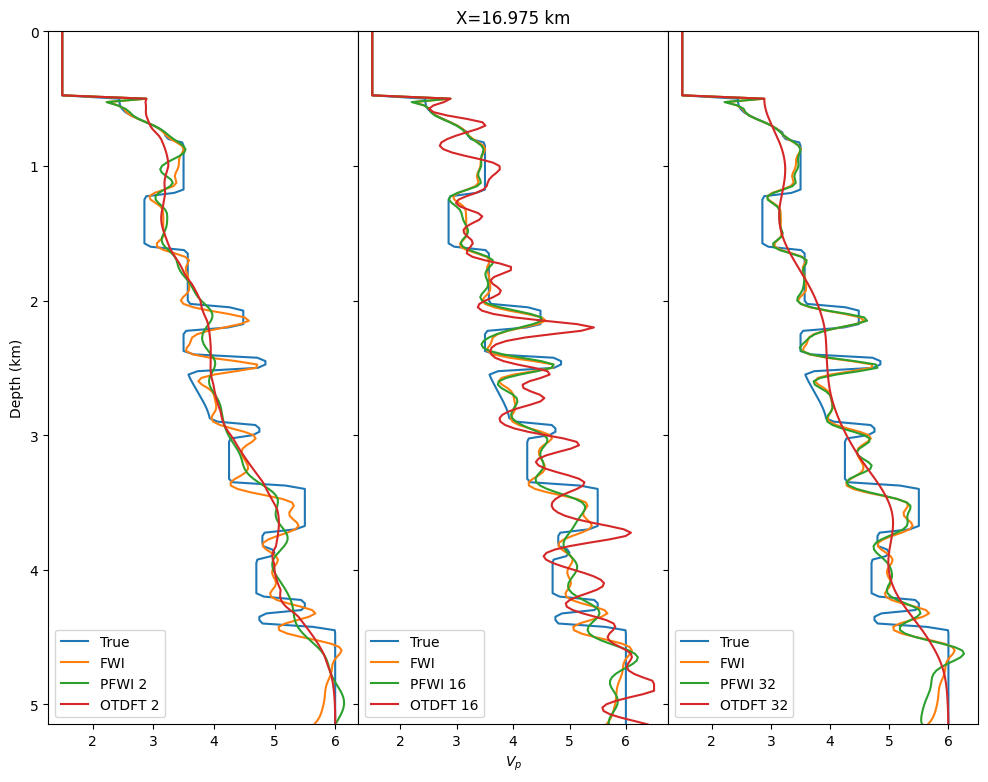

## Summary

blabla

## Introduction

- @louboutin2015segtcs
- @witte2018cls, bp [@Sirgue2010], [@Nihei2007]
- Time reverse [@McMechan, @Mittet, @RaknesR45]
- checkpointing [@Griewank, @Symes2007, @kukrejacomp]
- probing [@Avron, @hutchpp]
- Mengmeng EV [@vanleeuwen2015GPWEMVA, @yang2020lrpo]

- Implemented on top of JUDI [@witte2018alf] using Devito for the wave equations propagators [@devito-api, @devito-compiler]. Thanks to Devito's flexibility and JUDI's separation of concern, we can easily run the inversion with our memory efficient method on GPU with the same code adding a single flag.

## Theory

We consider the standard adjoint-state FWI problem that aims a minimizing the difference between field recorded data and numerically modelled synthetic data in a least-square sense[@lionsjl1971, @tarantola, @virieux, @louboutin2017fwi, @louboutin2017fwip2]. This data fitting problem is defined as:

```math {#adj}
\underset{\mathbf{m}}{\operatorname{minimize}} \ \frac{1}{2} ||\mathbf{F}(\mathbf{m}; \mathbf{q}) - \mathbf{d}_{obs} ||_2^2
```

where ``\mathbf{m}`` is the physical model parameter (squared slowness in the isotropic acoustic case), ``\mathbf{q}`` is the source, ``\mathbf{d}_{obs}`` is the observed data and ``\mathbf{F}`` is the forward modeling operator. This data misfit is usually minimized using gradient-based optimization methods such as gradient descent [@plessixasfwi] or gauss-newton [@li2015GEOPmgn] are necessary. In this work, we propose an unbiased estimate of that gradient, which means that that estimate equals the FWI gradient in expectation. In the following section, we describe our proposed method in the isotropic acoustic case.

### Adjoint state gradient

In the isotropic acoustic approximation of the physics, the gradient of the data misfit objective function #adj is defined as [@haber10tremp]:

```math {#iccc}
\mathcal{I} = \sum_t \rho(\mathbf{u}(t)) \eta(\mathbf{v}(t))
```

where ``\mathbf{u}, \mathbf{v}`` are the forward and adjoint wavefields solutions of the forward and adjoint wave equations and ``\rho, \eta`` are the imaging conditions function. For example, in the isoropic acoustic case we have ``\rho(\mathbf{u}(t)) = \frac{d^2 \mathbf{u}}{dt^2}(t)`` and ``\eta(\mathbf{v}(t)) = \mathbf{v}(t)``. Following standard linear algebra, this zero-lag correlation over time can be rewritten as the trace of an outer product of the time trace of the wavefields for each point ``\mathbf{x}`` in space as follows.

```math {#optr}
\mathcal{I}(\mathbf{x}) = \text{tr}\left [ \rho(\mathbf{u}(\mathbf{x}))\eta(\mathbf{v}(\mathbf{x}))^\top\right ].
```

This outer product is in practice not feasible to compute as each point in space requires an ``n_t x n_t`` matrix, with ``n_t`` the number of computational time steps. Computing this outer product woudl therefore require ``n_t`` more mem^\topory than standard FWI. To tackle this memory bottleneck, we instead compute this trace via matrix probing [@Avron, @hutchpp]. Matrix probing is a method that provides information about a matrix, in this case the trace, via matrix vector products when the matrix itself is either unknwn or too expensive to compute. The trace estimation of our outer product wrties as follows:
 
```math {#trpr}
    \tilde{\mathcal{I}}(\mathbf{x}) = \frac{1}{N} \sum_{i=1}^{N} \mathbf{z}_i^\top \rho(\mathbf{u}(\mathbf{x})) \eta(\mathbf{v}(\mathbf{x}))^\top \mathbf{z}_i \\
    \text{ s.t } \mathbb{E}(\mathbf{z}_i^\top \mathbf{z}_i) = 1, \mathbb{E}(\mathbf{z}_i) = 0,
```

or in its matrix form:

```math {#trprM}
    \tilde{\mathcal{I}}(\mathbf{x}) = \frac{1}{N} \text{tr}(\mathbf{Z}^\top \mathbf{u}(\mathbf{x}) \mathbf{v}(\mathbf{x})^\top \mathbf{Z}) \\
```

where ``\mathbf{Z}`` is the matrix with each ``\mathbf{z}_i`` in its column. We will discuss the importance of the choice for these probing vectors ``\mathbf{z}_i`` in a subsequent section. This probing, unlike computing the trace, does not require to compute the outer product but only matrix vector products that can be made extremely memory scheduling the computation accross the forward and adjoint propagation. In the above Equation #trpr, that memory optimal schedule is:

- 1. ``u_z = \mathbf{Z}^\top \rho(\mathbf{u}(\mathbf{x}))``
- 1. ``v_z = \eta(\mathbf{v}(\mathbf{x}))^\top \mathbf{Z} ``
- 3. ``\tilde{\mathcal{I}}(\mathbf{x}) = \text{tr}(u_z v_z)``.

Through these three steps, we obtain the unbiased [@hutchpp] estimate of the true update ``\mathbb{E}(\tilde{\mathcal{I}}) = \mathcal{I}`` that only requires randomized accumulation of the wavefields during their respective propagation. These three memory-optimal steps can then be merged with the time-stepper to implement efficient on-the-fly matrix probing, summarized in algorithm #pic\.

### Algorithm: {#pic}
| **for t=1:nt**
| 1. ``\mathbf{u}(t+1) = f(\mathbf{u}(t), \mathbf{u}(t-1), \mathbf{m}, \mathbf{q})``
| 2. ``u_z(\mathbf{x}) += \mathbf{Z}(t)^\top \rho(\mathbf{u}(t, \mathbf{x}))``
| **for t=nt:1**
| 1. ``\mathbf{v}(t-1) = f^\top(\mathbf{v}(t), \mathbf{v}(t+1), \mathbf{m}, \delta \mathbf{d})``
| 2. ``v_z(\mathbf{x}) += \eta(\mathbf{v}(t, \mathbf{x}))^\top \mathbf{Z}(t)``
| ``\tilde{\mathcal{I}}(\mathbf{x}) = \text{tr}(u_z v_z)``
: Seismic inversion via probed trace estimation where ``f, f^\top`` are the forward and backward time-stepping operators.

We compute our estimate for varying probing sizes and compare it to the true gradient on Figure #2d-grad\ . We show the probed estimate for varying number of probing vectors and the difference with true gradient. W ca clearly see that the accuracy increases wit the number of probing vectors and that we alread obtain a good approximation with as little as 16 to 32 vectors.

#### Figure: {#2d-grad}
{width=100%}\
{width=100%}
: Single source gradient and unbiased estimates for varying probing sizes.

With this few probing vector, we obtain massive memory reduction compared to conventional FWI whith a very small computationnal overhead (near negligeable in theory). We now detail the exact memory savings.


### Memory estimates

From this formulation, we can estimate the memory imprint of our method compared to conventional FWI. For completeness, we also consider other mainstream low memory methods: optimal checkpointing [@Griewank, @Symes2007, @kukrejacomp], boundary methods [@McMechan, @Mittet, @RaknesR45], and DFT methods [@witte2018cls,@Sirgue2010 ,@Nihei2007]. This memory overview generalizes to other wave-equations and imaging conditions easily as our method generalizes to any adjoint-state, zero-lag cross-correlation. We estimate the memory requirements for a three-dimensional domain with ``N_x N_y N_z`` grid points and ``n_t`` time steps. Conventional FWI requires to save the full time-space forward wavefield to compute the gradient. This requirement leads to a memory requirement of ``N n_t`` floating point values of memory in single precision. Our method, on the other hand, for ``p_s`` probing vector (i.e ``\mathbf{Z} \in \mathbb{R}^{n_t \times p_s}``), requires ``N p_s`` floating point values in the forward pass and ``N p_s`` in the backward pass for a total of ``2 N p_s`` value. The memory reduction factor is therefore ``\frac{n_t}{2 p_s}``. This memory reduction is similar to computing the gradient with ``p_s`` Fourier modes, i.e on-the-fly Fourier [@witte2018cls]. We summarize the memory usage compared to state-of-the-art algorithms in table #memest\.

### Table: {#memest}
|        |    FWI    |   DFT   |   Probing   | Optimal checkpointing| Boundary reconstruction |
|:------:|:---------:|:---------:|:---------:|:---------:|:---------:|
| Compute| 0         | ``\mathcal{O}(100) n_t N``| ``\mathcal{O}(10) n_t N``| ``\mathcal{O}(log(n_t)) N n_t``|``n_t N``|
| Memory | ``N n_t ``| ``\mathcal{O}(10) N``| ``\mathcal{O}(10) N`` | ``\mathcal{O}(10) N`` | ``n_t N^{\frac{2}{3}}`` |

: Memory estimates and computational overhead of different seismic inversion methods for ``n_t`` time steps and ``N`` grid points.

It is worth noting that unlike the other methods in the table, boundary reconstruction methods tend to have stability issues for more complex physics, in particular with physical attenuation making it ill-suited for real-world applications.

### Imaging condtions

In some cases, such as reverse-time migration (RTM) or to add emphasis to a certain range of wavenumber for FWI, an imaging condtion may be applied to the forward and adjoint wavefield instead of using the standard adjoint state gradient. Examples ofthese imaging conditions are the inverse scattering imaging condition [@Whitmore, @witteisic] for RTM or wavefield separation [@Faqi] for FWI. Usually, these imaging condition can be expressed as linear operators that only act on the spatial dimension fo the wavefields. Because such operators are linear and independent of times, we can factor them out and directl apply them to the probed vectors rather than at every time steps. This property can be seen from rewriting Equation #trpr as:

```math {#trpr_t}
    \tilde{\mathcal{I}}(\mathbf{x}) = \frac{1}{N} \sum_{i=1}^{N} \left [ \sum_{t=1}^{n_t} (\mathbf{z}_i(t) \rho(\mathbf{u}(t, \mathbf{x}))) \sum_{t=1}^{n_t}(\eta(\mathbf{v}(t, \mathbf{x})) \mathbf{z}_i(t)) \right ]
```

and in the above mentioned case where ``\rho`` and ``eta`` are linear operator only acting over the spatial dimensions we have:

```math {#lint} 
\sum_{t=1}^{n_t} \mathbf{z}_i(t) \rho(\mathbf{u}(t, \mathbf{x})) = \rho \left (\sum_{t=1}^{n_t} \mathbf{z}_i(t) \mathbf{u}(t, \mathbf{x}) \right ).
```

This property makes our probing method extremely advantageous as these imaging operations can be as expensive as an extra PDE if applied at every time steps while we only need to apply them ``\mathcal{O}(10)`` times.

### Probing vectors

In order to make our method very efficient, the choice of probing vectors ``\mathbf{z}_i`` is crucial. In its most simple formulation, this matrix probing method only requires random vectors from the normal distribution ``\mathbf{z}_i \in \mathbb{N}(0, 1)`` or the Radamaecher distribution (random ``\pm 1``) [@Avron]. However, matrix probing with these vectors has fairly low convergence rate and requires large number of probing vectors (``N >> 1``). To improve the estimate, [@hutchpp] proposed to compute a QR decomposition of the range of the matrix to be probed ``\mathbf{Z} = QR(\rho(\mathbf{u}(\mathbf{x})) \eta(\mathbf{v}(\mathbf{x}))^\top S)`` with ``S`` an ``n_t \times N`` matrix of ``± 1``. In theory, this QR factorization greatly improves the estimation. However, computing a QR factorization for each subsurface point would be unfeasible. As a proxy for the outer product of the wavefields, we compute a single probing matrix for the entire subsurface based on the observed data ``Z = QR(\mathbf{d}_{obs}\mathbf{d}_{obs}^\top S)`` since the data is the restriction of a wavefield.

We show what the probing vectors look like on Figure #pvec. It is of importance that these vectors are orthonormal but do not form a basis. They satisfy ``\mathbf{Z} \mathbf{Z}^\top = I`` but ``\mathbf{Z}^\top \mathbf{Z} \neq I`` is a low rank approximation of ``\mathbf{d}_{obs} \mathbf{d}_{obs}^\top`` as shown on Figure #pvec\. This sets our method apart from transform domain methods such as on-the-fly DFT that can be interpreted as probing methods where the probing vectors are a subset of the Fourier basis.

#### Figure: {#pvec}
{width=100%}
: Probing vector for varying probing size.


## Example

We illustrate our method on the 2D overthrust model and compare our inversion results to conventional FWI and on-the-fly DFT. The model is 20km by 5km isotropic acoustic. The dataset consists of 97 sources at 50m depth and 127 ocean bottom nodes (500m depth) 50m apart. The source function is an 8Hz Ricker wavelet. We show the true model and the initial background model on Figure #2d-setup\.


#### Figure: {#2d-setup}
{width=100%}
: True (top) and initial (bottom) velocity models for inversion.

In all the experiments presented here, we ran 20 iteration of spectral projected gradient (gradient descent with box constraints) [@schmidt09a] with 20 randomly selected shots per iteration [@Aravkin11TRridr]. We show the standard FWI inversion result for reference in both cases. We can clearly see on Figures #2d-fwi-probed that our probed gradient allows the inversion to carry towards a good result. As expected, for very few probing vectors, we do not converge since our approximation is too far from the true gradient, however, we start to obtain a result comparable to the true model with as few as 8 probing vectors and such result could ven be improved with some constraints or regularization. On the other hand, we can see on figure #2d-fwi-dft that for an equivalent memory cost, on-the-fly DFT fails to converge to an acceptable result for any number of frequencies, most likely due to the coherent artifact steming from the DFT. These results should however be improved by either a better choice of selected frequencies or by adding extra constraints and regularizations as well.


#### Figure: {#2d-fwi-dft}
{width=100%}
: On-the-fly DFT FWI on the 2D overthrust model with varying number of frequencies.


#### Figure: {#2d-fwi-probed}
{width=100%}
: Probed FWI on the 2D overthrust model with varying number of probing vectors.

We finally compare the three traces vertical highlighted in black on Figure #2d-setup to detail the accuracy of the inverted velocity on Figure #2d-fwi-tr\. These traces show that our probed inversion result is extremely close to standard FWI and that we obtain a result close to the true model.

#### Figure: {#2d-fwi-tr}
{width=33%}
{width=33%}
{width=33%}
: Vertical trace comparison between the true model, standard FWI, on-the-fly DFT and time probing.


## Discussion and Conclusions


## References